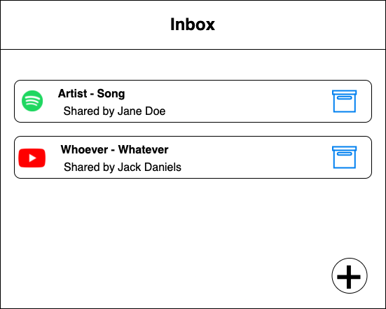

# Design
## Stories
### Adding friends
I want to add a friend so that I can send links to them.
I type in their username and click a button to send a request.
They see the request at the top of their inbox, along with my name and username, and confirm the friendship.

### Sharing links
I have a song on spotify that I want to share.
I open the web app, paste in a link, select friends to whom I want to send it, and press send.
I a message confirming that my link has been sent.

### Receiving links
Friends send me links; I see them in my inbox with the newest at the top of the screen, along with the name of the person who sent them to me.
I can click to open a link.
I can also click a button next to a link to archive it.
I can see archived links in a separate view.

## Database table design
```
users: username string primary key, name string, password string        ; password is a hash
friends: user1 references users, user2 references users
messages: id integer, link string, from string references users, to string references users, sent_at datetime, is_archived boolean
```

## Mockups


